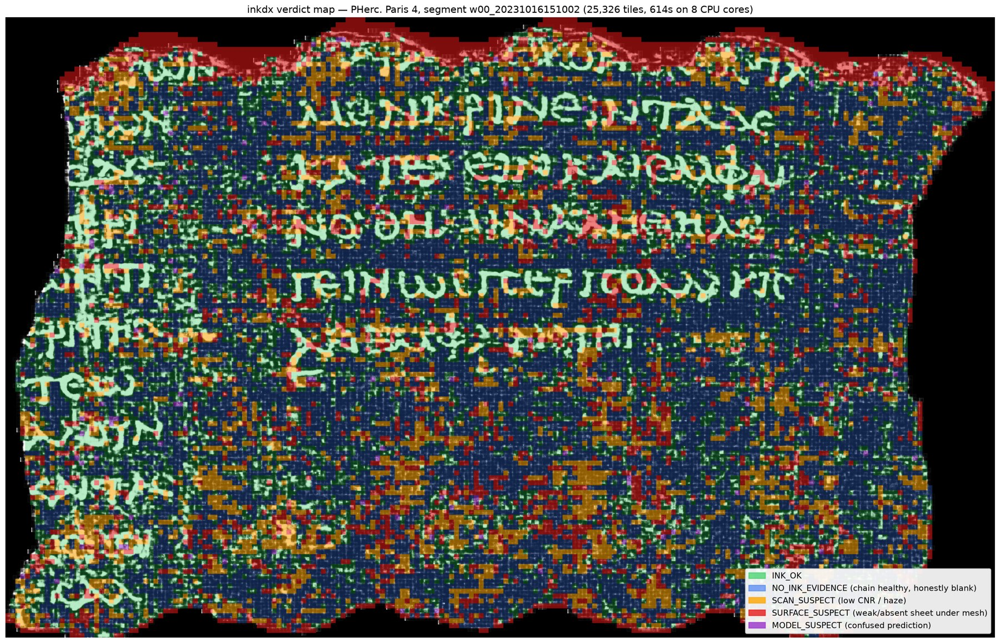
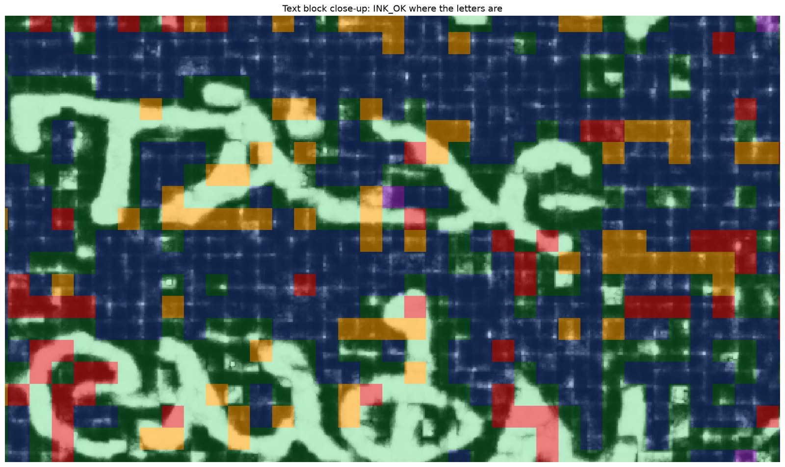
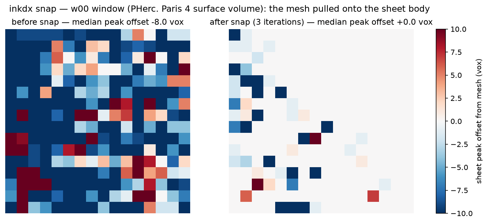
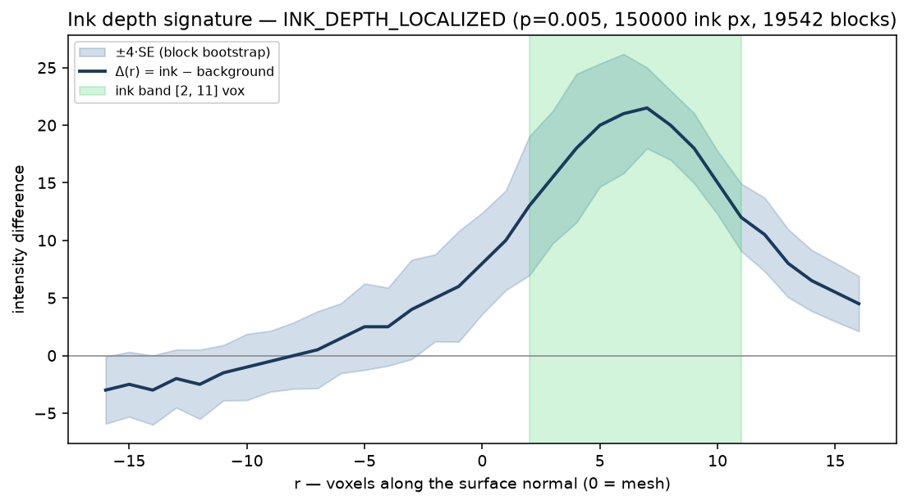
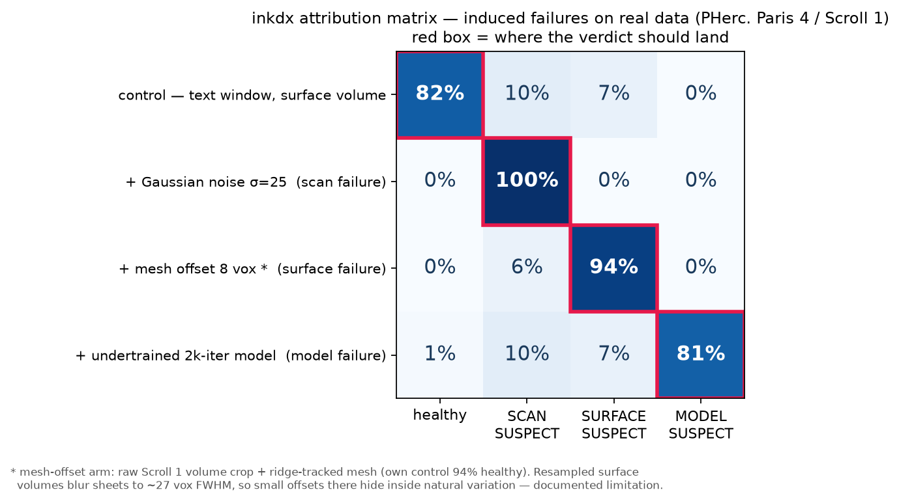

# inkdx

**When ink doesn't show up, inkdx tells you why: bad scan, bad surface, or bad model.**

`inkdx` is a diagnostics toolkit for the [Vesuvius Challenge](https://scrollprize.org)
virtual-unwrapping pipeline, addressing
[2026 open problem #9](https://scrollprize.org/2026_open_problems) (ink signal
detection & diagnostics — *"better diagnostics are more important than better
models"*). Given a scroll segment and optionally an ink prediction, it
attributes ink-recovery failure to a pipeline stage, per 256-px tile:

| Stage | Question | Example metrics |
|---|---|---|
| **Scan** | Is there usable CT signal here? | noise σ (raw-voxel), CNR, FWHM haze |
| **Surface** | Is the mesh actually on the papyrus sheet? | profile-peak offset & prominence, sheet-switch multiplicity, tearing, holes |
| **Model** | Does the ink model see and commit to signal? | bimodal separation vs mid-gray confusion |

Verdicts gate causally (data → scan → surface → model), so the first broken
stage claims the tile — and a tile whose whole chain is healthy but blank is
`NO_INK_EVIDENCE`: *trustworthy* blankness, because everything upstream
checked out.

## The w00 baseline (PHerc. Paris 4)

A full 1.6-gigapixel segment — 25,326 tiles — diagnosed in **614 s on 8 CPU
cores** (no GPU):



Green = ink found with a healthy chain; blue = healthy chain, honestly blank;
amber = scan-quality suspects (low CNR / haze — interior regions, not edge
artifacts); red = mesh not on a confident sheet (note the fringe exactly at
the scalloped segment boundary); purple = model confusion (near zero here).



## v0.2: from diagnosis to repair — `snap` and `label3d`

**[`inkdx snap`](docs/snap.md)** moves a tifxyz mesh onto the true sheet
using raw CT signal (no model, no GPU) — with anti-wrap peak selection,
confidence-gated holds, and a built-in before/after receipt. On a w00 window:
median sheet-peak offset **−8.0 → 0.0 vox**, prominence **+39%**, CNR
**+39%**. Snapped outputs carry a proposed tifxyz provenance convention.



**[`inkdx label3d`](docs/label3d.md)** measures **where in depth the ink
signal actually lives** — Δ(r) between ink-labeled and matched-background
columns, block-bootstrap significance — and emits true-3D labels (villa
wishlist #192) in the measured band. On PHerc. Paris 4: the ink signature is
unambiguous (p≈0.005) and **one-sided at [2, 11] vox** — the symmetric ±8
convention half-fills ink columns with signal-free voxels. When the signal
isn't significant, the tool says `NO_DEPTH_SIGNAL` and falls back, flagged.



## Install

```bash
git clone https://github.com/ash9241/inkdx && cd inkdx
uv sync                      # or: pip install -e .
```

Core is CPU-only and light (numpy/scipy/tifffile/zarr — no torch). The
optional `remote` extra adds streaming from dl.ash2txt.org via the `vesuvius`
library.

## Quickstart

```bash
# a surface volume (pre-extracted segment): layer TIFF dir or OME-Zarr
inkdx run --volume w00.zarr --prediction ink_pred.tif \
          --calibration calibration/w00_pherc_paris4.json \
          --processes 8 --out out/
# → out/report.json  out/report.html  out/maps/*.tif

# fit your own calibration pack from a segment you trust
inkdx calibrate --from-run out/ --name my_control --out my_pack.json
```

`report.json` is machine-readable (schema in [docs/schema.md](docs/schema.md))
with per-tile metrics, stage scores, verdicts, and located suspect regions
with z-score evidence — built to be consumed by other tools.
`report.html` is a single self-contained file: verdict overlay on the
prediction, per-stage heatmaps, healthy-band histograms, region drill-downs.

## Validation: the attribution matrix

Controlled failures induced on **real data** with known-recovered ink, then
re-inferenced and re-diagnosed — each must land in its own verdict class:



Noise → 100% SCAN_SUSPECT. An 8-voxel mesh offset → 94% SURFACE_SUSPECT. An
undertrained model on clean data → 81% MODEL_SUSPECT. Off-diagonal leakage
stays at the control's own background level.

Underneath, every metric is unit-tested against a synthetic phantom with
analytic ground truth (injected mesh offsets recovered to ±0.5 voxel, noise σ
recovered from raw voxels, monotonicity under ablation strength). See
[docs/attribution.md](docs/attribution.md) for the causal-gating design,
limitations, and full ablation results, and [docs/metrics.md](docs/metrics.md)
for every formula.

## Status

v0.1.0 (July 2026). Built and tested on PHerc. Paris 4 (w00 segment);
calibration packs for other scrolls are community-fittable via
`inkdx calibrate`. Feedback and issues welcome — especially reports from
segments where ink is *missing* and you want to know why.

## License

MIT
